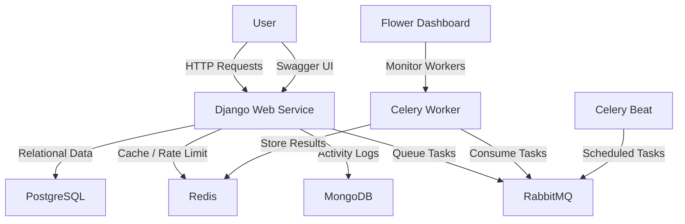

# Simple LMS

Simple LMS is a Learning Management System built with Django, Django Ninja, PostgreSQL, Docker, Redis, MongoDB, Celery, RabbitMQ, and Flower. The active application used by Docker lives under the `code/` directory.

## Features

- Custom `User` model with role support: `admin`, `instructor`, `student`
- Category hierarchy using a self-referencing relation
- Course and lesson management
- Enrollment and lesson progress tracking
- REST API under `/api/` using Django Ninja
- JWT authentication using `django-ninja-simple-jwt`
- Role-Based Access Control (RBAC) with `@is_admin`, `@is_instructor`, and `@is_student`
- Redis-based caching for course list and course detail endpoints
- Redis-backed request throttling for custom API endpoints in `core/apiv1.py`
- MongoDB activity logging and persisted learning analytics
- Celery tasks for email, certificates, report export, and scheduled statistics
- RabbitMQ as Celery broker
- Flower dashboard for Celery monitoring
- Swagger UI documentation at `/api/docs`
- Docker-based local development workflow

## Tech Stack

- Django
- PostgreSQL
- Django Ninja
- `django-ninja-simple-jwt`
- Redis
- MongoDB
- Celery
- RabbitMQ
- Flower
- Gunicorn
- WhiteNoise
- Docker / Docker Compose

## Architecture Diagram



## Project Structure

```text
simple-lms/
├── docker-compose.yml
├── Dockerfile
├── requirements.txt
├── README.md
└── code/
    ├── chapter11/
    │   ├── test_cache.py
    │   └── weather_api.py
    ├── manage.py
    ├── locustfile.py
    ├── config/
    │   ├── __init__.py
    │   ├── asgi.py
    │   ├── celery.py
    │   ├── settings.py
    │   ├── urls.py
    │   └── wsgi.py
    ├── core/
    │   ├── apiv1.py
    │   ├── mongo.py
    │   ├── schemas.py
    │   ├── tasks.py
    │   ├── tests.py
    │   └── utils.py
    ├── courses/
    │   ├── admin.py
    │   ├── fixtures/
    │   ├── migrations/
    │   ├── models.py
    │   ├── test_factories.py
    │   └── tests.py
    ├── templates/
    │   └── landing.html
    ├── jwt-signing.pem
    ├── jwt-signing.pub
    └── lms/            # legacy scaffold, not used by Docker
```

## Data Model Summary

### Main entities

- `User`: extends Django `AbstractUser` and adds `role`
- `Category`: supports parent-child category hierarchy
- `Course`: belongs to an instructor and an optional category
- `Lesson`: belongs to a course and has unique ordering per course
- `Enrollment`: links a student to a course
- `Progress`: tracks lesson completion for a student within an enrollment

### Relationship summary

| Model | Relation |
| --- | --- |
| `Course -> User` | `ForeignKey` |
| `Course -> Category` | `ForeignKey` |
| `Lesson -> Course` | `ForeignKey` |
| `Enrollment -> User` | `ForeignKey` |
| `Enrollment -> Course` | `ForeignKey` |
| `Progress -> Lesson` | `ForeignKey` |
| `Progress -> User` | `ForeignKey` |
| `Progress -> Enrollment` | `ForeignKey` |

## Running the Project

### 1. Prepare `.env`

Create a `.env` file in the project root with at least:

```env
POSTGRES_DB=lms_db
POSTGRES_USER=postgres
POSTGRES_PASSWORD=123456
POSTGRES_HOST=db
POSTGRES_PORT=5432
DEBUG=1
SECRET_KEY=change-this-secret
MONGODB_URI=mongodb://mongodb:27017/
MONGODB_DB_NAME=simple_lms
```

### 2. Start all services with Docker

```bash
docker-compose up --build -d
```

The `web` service runs migrations and `collectstatic` before starting Gunicorn. `celery-worker`, `celery-beat`, and `flower` are started by Docker Compose as separate services.

### 3. Generate RSA keys for JWT (first run)

```bash
docker-compose exec web python manage.py make_rsa
```

Because the container mounts `./code` to `/app`, the generated files will appear in the repository as:

- `code/jwt-signing.pem`
- `code/jwt-signing.pub`

### 4. Create a superuser

```bash
docker-compose exec web python manage.py createsuperuser
```

### 5. Run tests

```bash
docker-compose exec web python manage.py test
```

## Access URLs

| Service | URL | Description |
| --- | --- | --- |
| Home | http://localhost:8000 | Landing page |
| Admin | http://localhost:8000/admin | Django admin |
| API Docs | http://localhost:8000/api/docs | Swagger UI |
| Flower | http://localhost:5555 | Celery monitoring |

## Chapter 09 Coverage

This project is aligned with the Chapter 09 topic: advanced API integration with Redis, MongoDB, Celery, RabbitMQ, and monitoring.

### Learning objectives coverage

| Objective | Implementation |
| --- | --- |
| Redis caching patterns | Implemented in [code/core/apiv1.py](file:///E:/SEMESTER%206/PSS/simple-lms/code/core/apiv1.py) for course list and course detail |
| MongoDB document storage | Implemented in [code/core/mongo.py](file:///E:/SEMESTER%206/PSS/simple-lms/code/core/mongo.py) via `activity_log` documents |
| Asynchronous task processing with Celery | Implemented in [code/core/tasks.py](file:///E:/SEMESTER%206/PSS/simple-lms/code/core/tasks.py) |
| Message queue with RabbitMQ | Configured as `CELERY_BROKER_URL` in [code/config/settings.py](file:///E:/SEMESTER%206/PSS/simple-lms/code/config/settings.py) |
| Rate limiting | Implemented via `rate_limit()` in [code/core/apiv1.py](file:///E:/SEMESTER%206/PSS/simple-lms/code/core/apiv1.py) |

### Deliverables checklist

| Deliverable | Status | Notes |
| --- | --- | --- |
| Course list caching | Done | Redis cache key `courses_list:{search}:{category}:{limit}:{offset}` |
| Course detail caching | Done | Redis cache key `course_detail:{course_id}` |
| Cache invalidation strategy | Done | Triggered on create, update, and delete course |
| Rate limiting 60 req/min | Done | Applied in custom endpoints through `rate_limit()` |
| Activity Log collection | Done | Stored in MongoDB collection `activity_log` |
| Learning Analytics collection | Done | Aggregation result can be persisted into MongoDB collection `learning_analytics` through `sync_learning_analytics()` |
| Aggregation queries for reports | Done | Available through `aggregate_learning_analytics()` and `get_learning_analytics()` in `core/mongo.py` |
| `send_enrollment_email` | Done | Celery task |
| `generate_certificate` | Done | Celery task |
| `update_course_statistics` | Done | Scheduled Celery Beat task |
| `export_course_report` | Done | Async CSV export task |
| Docker Compose services | Done | `web`, `db`, `redis`, `mongodb`, `rabbitmq`, `celery-worker`, `celery-beat`, `flower` |
| Flower monitoring | Done | Exposed at `http://localhost:5555` |
| Redis CLI documentation | Done | Documented in README |
| Architecture diagram | Done | Mermaid section included |
| Caching strategy explanation | Done | Documented below |
| Task flow documentation | Done | Documented below |

## Chapter 10 Coverage

This project now includes automated testing for unit tests, integration tests, fixtures, simple factory helpers, coverage analysis, and API load testing with Locust.

### Testing scope

| Area | Implementation |
| --- | --- |
| Unit testing for model logic | [code/courses/tests.py](file:///E:/SEMESTER%206/PSS/simple-lms/code/courses/tests.py) |
| Unit testing for helpers, Mongo, tasks, and rate limiting | [code/core/tests.py](file:///E:/SEMESTER%206/PSS/simple-lms/code/core/tests.py) |
| Integration testing for API endpoints | [code/core/tests.py](file:///E:/SEMESTER%206/PSS/simple-lms/code/core/tests.py) |
| Fixture-based testing | [code/courses/fixtures/initial_data.json](file:///E:/SEMESTER%206/PSS/simple-lms/code/courses/fixtures/initial_data.json) |
| Factory helper for test data | [code/courses/test_factories.py](file:///E:/SEMESTER%206/PSS/simple-lms/code/courses/test_factories.py) |
| API load testing | [code/locustfile.py](file:///E:/SEMESTER%206/PSS/simple-lms/code/locustfile.py) |
| Coverage dependency | [requirements.txt](file:///E:/SEMESTER%206/PSS/simple-lms/requirements.txt) |

### Coverage result

Latest coverage run inside the Docker container for source packages `courses` and `core`:

```text
TOTAL 93%
```

This already passes the minimum target coverage of 80% from the Chapter 10 brief.

## Chapter 11 Coverage

This project also includes a simple Redis caching exercise for a simulated weather API call, implemented separately from the LMS API so it can be run as an isolated lab.

### Files

| Deliverable | Implementation |
| --- | --- |
| Weather caching function | [code/chapter11/weather_api.py](file:///E:/SEMESTER%206/PSS/simple-lms/code/chapter11/weather_api.py) |
| Testing script | [code/chapter11/test_cache.py](file:///E:/SEMESTER%206/PSS/simple-lms/code/chapter11/test_cache.py) |
| Documentation report | [cache_report.md](file:///E:/SEMESTER%206/PSS/simple-lms/cache_report.md) |

### Chapter 11 behavior

- Cache key format: `weather:{city}`
- Redis operations: `GET`, `SET`, `EXPIRE`
- Cache expiry: `300` seconds
- First call is intentionally slow because of simulated API latency
- Second call is fast because the result is returned from Redis

### Run the weather cache demo

```bash
docker-compose exec web python chapter11/test_cache.py
```

## Chapter 12 Coverage

This project now uses MongoDB as a document store for activity logs and analytics, with CRUD helper functions, embedded snapshots, aggregation pipelines, and analytics endpoints exposed through Django Ninja.

### Learning objectives coverage

| Objective | Implementation |
| --- | --- |
| Document-oriented database concepts | Reflected in `activity_logs` and `learning_analytics` collections with flexible `metadata` documents |
| Setup MongoDB using Docker Compose | `mongodb` service exposed on port `27017` in [docker-compose.yml](file:///E:/SEMESTER%206/PSS/simple-lms/docker-compose.yml) |
| CRUD operations in MongoDB | Implemented in [code/core/mongo.py](file:///E:/SEMESTER%206/PSS/simple-lms/code/core/mongo.py) via `log_activity()`, `list_activity_logs()`, `update_activity_logs()`, `delete_activity_logs()`, and `record_daily_login()` |
| Document modeling (embedding vs referencing) | Activity logs embed `user_snapshot`, `course_snapshot`, and `lesson_snapshot` while still storing relational IDs |
| Aggregation pipeline for analytics | Implemented through `build_learning_analytics_pipeline()` and `aggregate_learning_analytics()` |
| Django integration with `pymongo` | Mongo helpers are consumed by [code/core/apiv1.py](file:///E:/SEMESTER%206/PSS/simple-lms/code/core/apiv1.py) and covered in [code/core/tests.py](file:///E:/SEMESTER%206/PSS/simple-lms/code/core/tests.py) |

### Deliverables status

| Deliverable | Status | Notes |
| --- | --- | --- |
| MongoDB service in Docker | Done | Service `mongodb` with persistent volume and port mapping |
| CRUD operations | Done | Insert, read, update, delete, and upsert helper functions implemented |
| Activity log collection | Done | Stored in `activity_logs` |
| Learning analytics collection | Done | Persisted in `learning_analytics` |
| Aggregation pipeline | Done | Course-level activity analytics available and can be rebuilt |
| API integration | Done | Analytics endpoints added under `/api/analytics/*` |
| Automated tests | Done | Mongo helper and analytics API tests added |

### MongoDB collections

#### `activity_logs`

Document shape:

```json
{
  "_id": "ObjectId",
  "user_id": 1,
  "user_role": "student",
  "action": "COURSE_VIEW",
  "course_id": 2,
  "lesson_id": null,
  "metadata": {
    "browser": "Chrome",
    "duration_seconds": 1200
  },
  "user_snapshot": {
    "id": 1,
    "username": "student1",
    "email": "student1@example.com",
    "role": "student"
  },
  "course_snapshot": {
    "id": 2,
    "name": "Django Basics",
    "category_id": 1,
    "instructor_id": 3,
    "instructor_username": "teacher1"
  },
  "lesson_snapshot": null,
  "created_at": "2026-07-04T00:00:00+00:00"
}
```

This uses a hybrid modeling approach:

- referencing for stable relational identifiers: `user_id`, `course_id`, `lesson_id`
- embedding for read-optimized snapshots: `user_snapshot`, `course_snapshot`, `lesson_snapshot`

#### `learning_analytics`

Aggregated document shape:

```json
{
  "course_id": 2,
  "course_name": "Django Basics",
  "total_actions": 42,
  "unique_user_count": 10,
  "action_type_count": 4,
  "last_activity_at": "2026-07-04T00:00:00+00:00"
}
```

### MongoDB shell verification

```bash
# Open Mongo shell inside the container
docker-compose exec mongodb mongosh

# Switch to the app database
use simple_lms

# Show collections
show collections

# Read latest activity logs
db.activity_logs.find().sort({ created_at: -1 }).limit(5)

# Mark course views as reviewed
db.activity_logs.updateMany(
  { action: "COURSE_VIEW" },
  { $set: { reviewed: true } }
)

# Count course view logs
db.activity_logs.countDocuments({ action: "COURSE_VIEW" })

# Read persisted analytics
db.learning_analytics.find().sort({ total_actions: -1 })
```

## REST API

The API is registered in [code/config/urls.py](file:///E:/SEMESTER%206/PSS/simple-lms/code/config/urls.py) and implemented in [code/core/apiv1.py](file:///E:/SEMESTER%206/PSS/simple-lms/code/core/apiv1.py).

### Base path

```text
/api/
```

### Authentication

The `sign-in` and `token-refresh` endpoints are provided by `mobile_auth_router` from `django-ninja-simple-jwt`. Registration and profile endpoints are custom handlers in `core/apiv1.py`.

| Method | Endpoint | Description |
| --- | --- | --- |
| POST | `/api/auth/register` | Register a new user |
| POST | `/api/auth/sign-in` | Login and get access + refresh tokens |
| POST | `/api/auth/token-refresh` | Refresh access token |
| GET | `/api/auth/me` | Get current authenticated user |
| PUT | `/api/auth/me` | Update current authenticated user profile |

### Courses

| Method | Endpoint | Description |
| --- | --- | --- |
| GET | `/api/courses` | List courses with optional `search`, `category_id`, `limit`, `offset` |
| GET | `/api/courses/{course_id}` | Get course detail with lesson titles |
| POST | `/api/courses` | Create course (`instructor` or `admin`) |
| PATCH | `/api/courses/{course_id}` | Update course (owner instructor or admin) |
| DELETE | `/api/courses/{course_id}` | Delete course (`admin` only) |
| POST | `/api/courses/{course_id}/export-report` | Trigger async CSV export (owner instructor or admin) |

### Enrollments

| Method | Endpoint | Description |
| --- | --- | --- |
| POST | `/api/enrollments` | Enroll in a course (`student` or `admin`) |
| GET | `/api/enrollments/my-courses` | Get current user's enrollments |
| POST | `/api/enrollments/{enrollment_id}/progress` | Mark a lesson as completed |

### Analytics

| Method | Endpoint | Description |
| --- | --- | --- |
| GET | `/api/analytics/activity-logs` | Read MongoDB activity logs with optional `course_id`, `action`, `limit`, `offset` |
| GET | `/api/analytics/learning` | Read aggregated course analytics with optional `course_id` and `refresh` |
| POST | `/api/analytics/learning/rebuild` | Rebuild and persist `learning_analytics` collection (`admin`) |
| PATCH | `/api/analytics/activity-logs/review` | Mark activity logs as reviewed by `action` (`admin`) |
| DELETE | `/api/analytics/activity-logs` | Delete activity logs by `action` (`admin`) |

### Caching

- Course list cache key: `courses_list:{search}:{category}:{limit}:{offset}`
- Course detail cache key: `course_detail:{course_id}`
- Cache duration: 5 minutes
- Cache invalidation happens on course create, update, and delete

### Rate limiting

Custom endpoints implemented in `core/apiv1.py` call `rate_limit()` and are limited to 60 requests per minute, with counters stored in Redis. This does not cover third-party auth router internals unless they apply their own throttling.

### MongoDB usage

- `activity_logs`: stores user activity inserted by `log_activity()`
- `learning_analytics`: stores persisted aggregation results from `sync_learning_analytics()`
- Aggregation queries are built in [code/core/mongo.py](file:///E:/SEMESTER%206/PSS/simple-lms/code/core/mongo.py) and can be exposed through `/api/analytics/learning`

### Celery tasks

1. `send_enrollment_email`: sends an email after successful enrollment
2. `generate_certificate`: triggered when all lessons in a course are completed
3. `update_course_statistics`: scheduled every 5 minutes by Celery Beat
4. `export_course_report`: exports enrollment data as CSV content

## Task Flow Documentation

### Enrollment flow

1. Student calls `POST /api/enrollments`
2. Django creates the enrollment row in PostgreSQL
3. Activity is logged to MongoDB through `log_activity()`
4. Celery task `send_enrollment_email.delay(...)` is sent to RabbitMQ
5. `celery-worker` consumes the message and sends the email

### Course completion flow

1. Student calls `POST /api/enrollments/{enrollment_id}/progress`
2. Django stores or updates progress in PostgreSQL
3. Activity is logged to MongoDB
4. When all lessons are completed, `generate_certificate.delay(...)` is sent to RabbitMQ
5. `celery-worker` processes the certificate task asynchronously

### Report export flow

1. Instructor or admin calls `POST /api/courses/{course_id}/export-report`
2. Django validates authorization and logs the activity
3. `export_course_report.delay(course_id)` is sent to RabbitMQ
4. `celery-worker` generates CSV content in the background

### Analytics rebuild flow

1. Admin calls `POST /api/analytics/learning/rebuild`
2. Django aggregates `activity_logs` through MongoDB aggregation pipeline
3. Each course summary is upserted into `learning_analytics`
4. Analytics can then be queried quickly through `GET /api/analytics/learning`

### Scheduled statistics flow

1. `celery-beat` triggers `update_course_statistics` every 5 minutes
2. The task is published to RabbitMQ
3. `celery-worker` consumes and executes the task
4. Output is currently written to worker logs

## Docker Compose Services

| Service | Role |
| --- | --- |
| `web` | Django application |
| `db` | PostgreSQL relational database |
| `redis` | Cache and rate-limit counter store |
| `mongodb` | Document storage for activity logs and analytics |
| `rabbitmq` | Celery message broker |
| `celery-worker` | Background task worker |
| `celery-beat` | Scheduler for periodic tasks |
| `flower` | Celery monitoring UI |

## Monitoring

### Flower

- URL: `http://localhost:5555`
- Purpose: monitor running, queued, succeeded, and failed Celery tasks
- Main use cases:
  - verify `send_enrollment_email`
  - verify `generate_certificate`
  - verify `update_course_statistics`
  - verify `export_course_report`

### Useful Docker commands

```bash
# Check all running services
docker-compose ps

# Inspect web logs
docker-compose logs -f web

# Inspect Celery worker logs
docker-compose logs -f celery-worker

# Inspect Celery Beat logs
docker-compose logs -f celery-beat

# Inspect Flower logs
docker-compose logs -f flower
```

## Automated Testing

### Run the full Django test suite

```bash
docker-compose exec web python manage.py test -v 2
```

### Run coverage

```bash
docker-compose exec web sh -c "coverage erase && coverage run --source='courses,core' manage.py test && coverage report"
```

### Test architecture

- `courses/tests.py` covers model behavior, constraints, ordering, progress calculation, and fixture loading
- `core/tests.py` covers decorators, rate limiting, Mongo helpers, Celery tasks, and API integration flows
- During `manage.py test`, settings automatically switch to:
  - SQLite test database
  - local in-memory cache
  - local email backend
  - eager Celery execution

This keeps the test suite fast, isolated, and repeatable.

## Load Testing

Locust configuration is available in [code/locustfile.py](file:///E:/SEMESTER%206/PSS/simple-lms/code/locustfile.py).

### Run Locust

```bash
docker-compose exec web locust -f /app/locustfile.py --host=http://localhost:8000
```

Then open:

- `http://localhost:8089`

### Load test targets

- `GET /api/courses`
- `GET /api/courses?search=Django`
- `GET /api/courses/1`
- `GET /api/docs`

## Redis CLI Commands

```bash
# Open Redis DB 1 (used by Django cache / rate-limit counters)
docker-compose exec redis redis-cli -n 1

# List keys
KEYS *

# Clear current DB
FLUSHDB
```

## Query Optimization

The model layer includes queryset helpers in [code/courses/models.py](file:///E:/SEMESTER%206/PSS/simple-lms/code/courses/models.py):

- `Course.objects.for_listing()`
- `Enrollment.objects.for_student_dashboard()`

The codebase also uses `select_related`, `prefetch_related`, and `annotate(...)` for common course and enrollment queries.

MongoDB-side analytics use:

- descending indexes on `created_at`, `user_id`, `course_id`, and `action`
- persisted summaries in `learning_analytics` for repeated reads

## Django Admin

Admin configuration lives in [code/courses/admin.py](file:///E:/SEMESTER%206/PSS/simple-lms/code/courses/admin.py) and includes:

- Search for users, courses, enrollments, and progress data
- Filters for role, category, instructor, and completion status
- Inline lesson editing inside the course admin page
- Enrollment progress percentage display

## Important Files

- Models: [code/courses/models.py](file:///E:/SEMESTER%206/PSS/simple-lms/code/courses/models.py)
- Admin: [code/courses/admin.py](file:///E:/SEMESTER%206/PSS/simple-lms/code/courses/admin.py)
- API Routes: [code/core/apiv1.py](file:///E:/SEMESTER%206/PSS/simple-lms/code/core/apiv1.py)
- API Schemas: [code/core/schemas.py](file:///E:/SEMESTER%206/PSS/simple-lms/code/core/schemas.py)
- Role Decorators: [code/core/utils.py](file:///E:/SEMESTER%206/PSS/simple-lms/code/core/utils.py)
- MongoDB Integration: [code/core/mongo.py](file:///E:/SEMESTER%206/PSS/simple-lms/code/core/mongo.py)
- Chapter 11 Demo: [code/chapter11/weather_api.py](file:///E:/SEMESTER%206/PSS/simple-lms/code/chapter11/weather_api.py)
- Celery Tasks: [code/core/tasks.py](file:///E:/SEMESTER%206/PSS/simple-lms/code/core/tasks.py)
- Django Settings: [code/config/settings.py](file:///E:/SEMESTER%206/PSS/simple-lms/code/config/settings.py)
- Celery Config: [code/config/celery.py](file:///E:/SEMESTER%206/PSS/simple-lms/code/config/celery.py)
- URL Configuration: [code/config/urls.py](file:///E:/SEMESTER%206/PSS/simple-lms/code/config/urls.py)
- Docker Compose: [docker-compose.yml](file:///E:/SEMESTER%206/PSS/simple-lms/docker-compose.yml)

## Submission Checklist

Before submission, make sure the repository contains:

- Source code for Django, Redis, MongoDB, Celery, and RabbitMQ integration
- Updated `README.md` with architecture, caching strategy, task flow, and monitoring notes
- `docker-compose.yml` with all required services
- API code under [code/core/apiv1.py](file:///E:/SEMESTER%206/PSS/simple-lms/code/core/apiv1.py)
- Background task code under [code/core/tasks.py](file:///E:/SEMESTER%206/PSS/simple-lms/code/core/tasks.py)
- MongoDB integration under [code/core/mongo.py](file:///E:/SEMESTER%206/PSS/simple-lms/code/core/mongo.py)

Submission target from the assignment brief:

1. Upload source code to a Git repository
2. Submit the repository URL to KULINO

## Assessment Mapping

| Kriteria | Bobot | Kondisi di Repo |
| --- | --- | --- |
| Redis caching implementation | 25% | Implemented for course list, course detail, invalidation, and rate limiting |
| MongoDB integration | 20% | Activity log CRUD, aggregation pipeline, and persisted `learning_analytics` collection are implemented |
| Celery tasks (minimal 4 tasks) | 25% | 4 tasks implemented in `core/tasks.py` |
| Docker Compose dengan semua services | 15% | Implemented in `docker-compose.yml` |
| Monitoring dan documentation | 15% | README, Mermaid architecture, Redis CLI docs, task flow, and Flower monitoring documented |

## Notes

- Docker uses the Django project under `code/config`.
- The `code/lms/` directory is still present in the repository, but it is not the active project used by Docker.
- Swagger UI is available at `http://localhost:8000/api/docs`.
